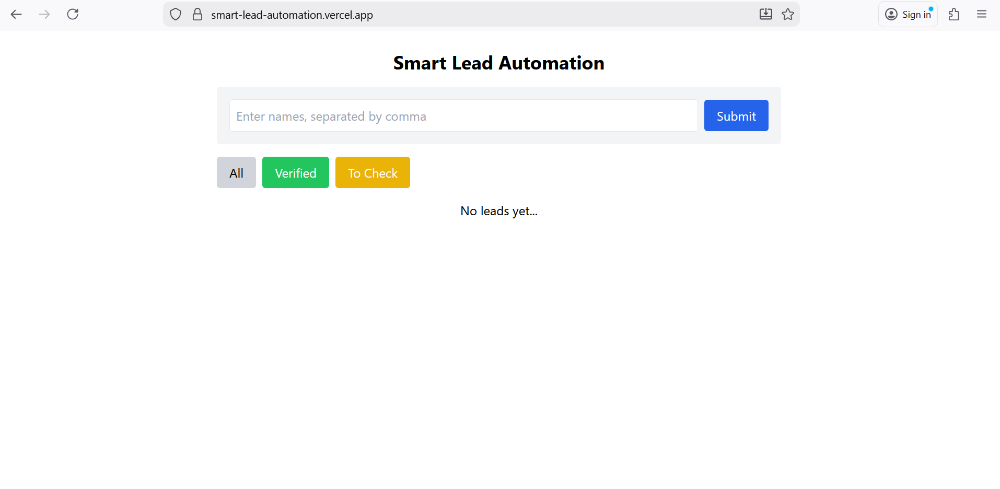
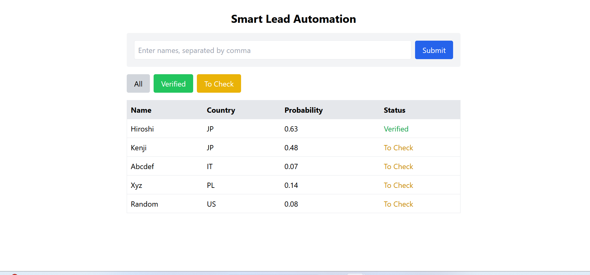
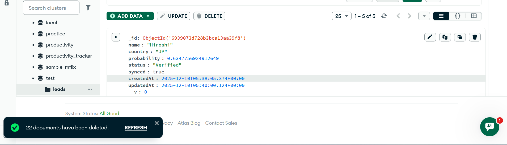

# Smart Lead Automation (VR Automations Assignment)

This project is a full-stack application that simulates a simple lead enrichment and background automation workflow. It takes a list of names, predicts their nationality using the Nationalize API, applies a business rule, stores the result in the database, and runs a scheduled sync task every 5 minutes.

## Tech Stack
Frontend: React (Vite), TailwindCSS
Backend: Node.js, Express.js
Database: MongoDB Atlas
Deployment: Vercel (Frontend) and Render (Backend)

## Features
1. Input multiple names (for example: Hiroshi, Ravi, Muhammad)
2. Each name is enriched using the Nationalize API
3. Extracts predicted country and probability
4. Applies business logic
   - If probability > 0.6 → Status: Verified
   - Else → Status: To Check
5. Displays results in a dashboard with filters
   - All
   - Verified
   - To Check
6. Runs a background Cron Job every 5 minutes
   - Finds only verified and unsynced leads
   - Logs a simulated CRM message
   - Marks them as synced (so they are not processed again)

## Architecture (Short Explanation)
1. User enters a list of names in the frontend
2. Frontend sends names to backend
3. Backend sends API requests to Nationalize API
4. Extracts highest probability country
5. Applies business rule
6. Saves the result to MongoDB
7. A background Cron Job runs every 5 minutes to process verified leads
8. CRM sync is simulated using console logs

## Setup Instructions

Clone the repository:
Setup Instructions
git clone https://github.com/Aditya05016/SmartLeadAutomation.git
cd SmartLeadAutomation

# Backend Setup
cd backend
npm install
npm start

# Frontend Setup
cd ../frontend
npm install
npm run dev

After starting backend, open:
http://localhost:5000

After starting frontend, open:
http://localhost:5173
## Environment Variables
Create a .env file inside backend:
MONGO_URI=your-mongodb-atlas-url
PORT=5000

## Live Demo
Frontend: https://smart-lead-automation.vercel.app
Backend: https://smartleadautomation.onrender.com

## Screenshots

### Frontend UI

### Dashboard Table View

### MongoDB Collection

## Notes
This project is submitted as part of the VR Automations assignment.

